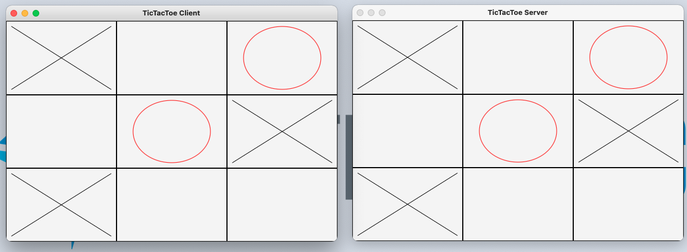

# Server and Client TicTacToe

## Synopsis
This is a 2 player game of TicTacToe. 2 Players battle against each other in different windows.

## Motivation
This project was made with JavaFX to demonstrate networking and advanced java graphics ideas taught in CSCI 1175 Industry Projects

## How to Run
To play this game two players must share the same network.
Each player will run either Client or Server and connect to each other before taking turns placing tiles on the board to get 3 in a row.



## Code Example
This piece of code starts the server and waits for a connection from the client when the connect button is pressed. 
```
protected void connectButton(MouseEvent event) {
		new Thread(() -> {
			try {
				ServerSocket serverSocket = new ServerSocket(8000);
				Platform.runLater(() -> {
					System.out.println("Server started at " + new Date());
				});
				connect.setVisible(false);
				Socket socket = serverSocket.accept();
				inputFromClient = new DataInputStream(socket.getInputStream());
				outputToClient = new DataOutputStream(socket.getOutputStream());
				turn = 0;
				started = true;
				while(true) {
					turn = inputFromClient.readInt();
					tile = inputFromClient.readInt();
					Platform.runLater(() -> {
						lastMove(tile);
					});
				}
			}
			catch(IOException ex) {
				ex.printStackTrace();
			}
		}).start();
	}
```
